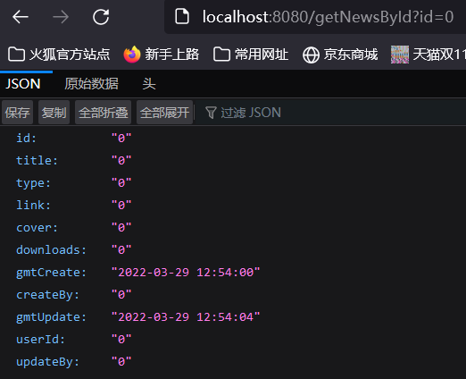
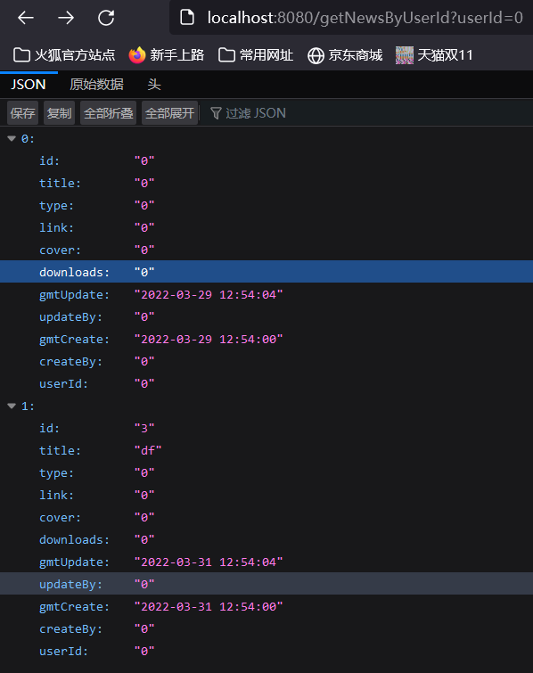
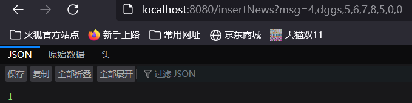
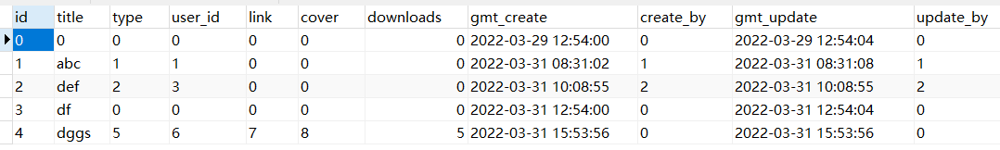

# 任务完成情况简述

## 数据库测试用例如下

**sci_news表**


**sys_user表**


## User和News类
分别位于
`src\main\java\com\example\springbootmybatis\DAO\User.java`
`src\main\java\com\example\springbootmybatis\DAO\News.java`


## Controller

代码位于`src\main\java\com\example\springbootmybatis\controller`下

**NewsController**

```java
    @ResponseBody
    @RequestMapping("/getNewsById")
    public News getNewsById(String id){
        return newsMapper.getNewsById(id);
    }

    @ResponseBody
    @RequestMapping("/getNewsByUserId")
    public List<News> getNewsByUserId(String userId){
        return newsMapper.getNewsByUserId(userId);
    }

    /**
     * @param: msg the message string to new a News() object when GET like insertNews?msg="2,def,2,3,0,0,0,2,2"
     * @return: number of inserted lines
     */
    @ResponseBody
    @RequestMapping("/insertNews")
    public int insertNews(String msg){
        News n = new News(msg);
        return newsMapper.insertNews(n);
    }
```

`UserController`由学习网站的代码改编而来，只用于学习，与任务无关

## Mapper

`NewsMapper`位于`src\main\resources\mapper\NewsMapper.xml`
`getNewsById`用于通过新闻的ID查询新闻的概况
`insertNews`用于通过User对象来插入数据
`getNewsByUserId`用于通过`userId`查询`sci_news`表中所有`user_id=userId`的新闻

```xml
<mapper namespace="com.example.springbootmybatis.mapper.NewsMapper">
    <!-- 此处与接口方法名对应 指定参数类型与返回结果类型-->
    <select id="getNewsById" parameterType="java.lang.String" resultType="com.example.springbootmybatis.DAO.News">
        SELECT * FROM sci_news WHERE id = #{id}
    </select>

    <insert id="insertNews" parameterType="com.example.springbootmybatis.DAO.News">
        INSERT INTO sci_news VALUES (
            #{id}, #{title}, #{type}, #{user_id}, #{link}, #{cover}, #{downloads}, #{gmt_create}, #{create_by}, #{gmt_update}, #{update_by});
    </insert>

    <select id="getNewsByUserId" parameterType="java.lang.String" resultType="com.example.springbootmybatis.DAO.News">
        SELECT * FROM sci_news WHERE user_id IN (SELECT id FROM sys_user WHERE id = #{userId});
    </select>
</mapper>
```

## 浏览器访问接口情况

**/getNewsById?id=0**


**/getNewsByUserId?id=0**


**/insertNews?msg=4,dgg,5,6,7,8,5,0,0**

插入数据后`sci_news`表为
