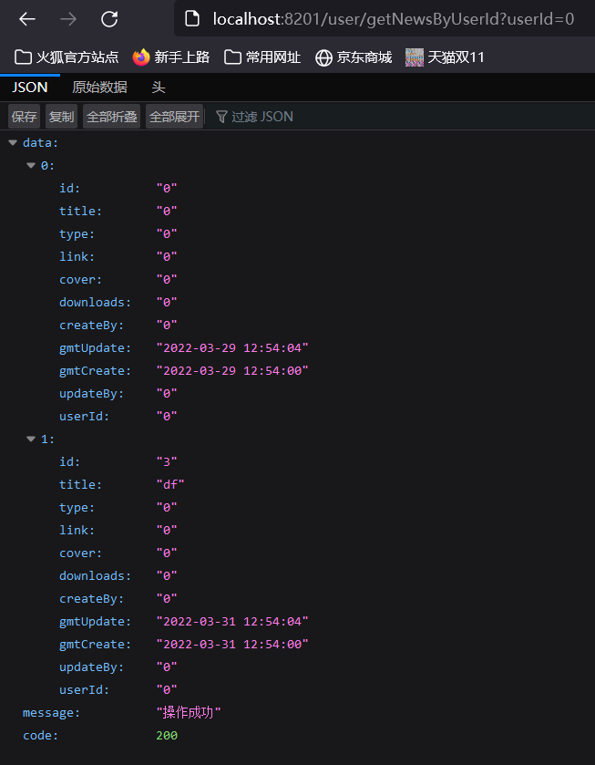

# 进阶任务完成情况简述

## 数据库测试用例如下

**sci_news表**


**sys_user表**


----------------


## Spring Gateway模块 `9201` 端口

配置文件如下

```yaml
server:
  port: 9201

service-url:
  user-service: http://localhost:8201
  news-service: http://localhost:8301

spring:
  cloud:
    gateway:
      routes:
        - id: user_route
          uri: ${service-url.user-service}/user
          predicates:
            - Path=/user/**
        - id: news_route
          uri: ${service-url.news-service}/news
          predicates:
            - Path=/news/**

logging:
  level:
    org.springframework.cloud.gateway: debug
```


-------------------


## Eureka注册中心模块 `8001` 端口


在启动类上添加@EnableEurekaServer注解来启用Euerka注册中心功能

配置文件如下

```
server:
  port: 8001

spring:
  application:
    name: eureka-server

eureka:
  instance:
    hostname: localhost
  client:
    fetch-registry: false
    register-with-eureka: false
```

--------------


## News模块 `8301` 端口

### 目录结构

``` 
└─news-service
   ├─.mvn
   │  └─wrapper
   ├─src
   │  ├─main
   │  │  ├─java
   │  │  │  └─com
   │  │  │      └─example
   │  │  │          └─newsservice
   │  │  │              ├─controller
   │  │  │              ├─dao
   │  │  │              ├─pojo
   │  │  │              └─service
   │  │  │                  └─impl
   │  │  └─resources
   │  │      ├─dao
   │  └─test
   └─target
```

### pojo层

定义了 `News` 和 `RequestResult` 两个类
定义中出现了这样的代码
```java
    @JsonProperty("userId")
    private String user_id;
```
不使用驼峰命名的 `userId` 而是这样写的原因是 `mysql` 表中的列名是 `user_id` 查询时的返回结果会根据这个来初始化 News 对象中的字段，如果使用 `userId` ，则返回的 `News` 对象中的 `user_id` 字段会为 `null` 。
如果不添加 JsonProperty 注释，则 `User` 模块通过 `Feign Client` 调用 `News` 的微服务时， `News` 正确的返回结果在 `User` 模块那边会莫名变成

即字段名会自动由 `user_id` 变成 `userId` 。添上注释后，两边传递的数据中就都是 `userId` 。

### dao层

接口定义如下

```java
@Mapper
public interface NewsDAO {
    News getNewsById(String id);
    List<News> getNewsByUserId(String userId);
    int insertNews(News n);
}
```

使用 `mybatis` 架构，使用 `xml` 实现查询接口，`*.xml` 文件在 `resources/dao` 下

### service层

接口定义如下

```java
public interface NewsService {
    News getNews(String id);
    List<News> listNewsByIds(List<String > ids);
    List<News> getNewsByUserId(String userId);
    int insertNews(News n);
}
```

本次任务中暂时使用到的只有 `getNews` 和 `getNewsByUserId`

### controller层

主要代码如下

```java
@RestController
@RequestMapping(value = "/news")
public class NewsController {
    private static final Logger LOGGER = LoggerFactory.getLogger(NewsController.class);

    private final NewsService newsService;

    public NewsController(NewsService newsService) {
        this.newsService = newsService;
    }

    @GetMapping("/getNewsById")
    public RequestResult<News> getNews(String id) {
        News news = newsService.getNews(id);
        LOGGER.info("根据id获取新闻信息，新闻标题为：{}", news.getTitle());
        return new RequestResult<>(news);
    }

    @GetMapping("/getNewsByUserId")
    public RequestResult<List<News>> getNewsByUserId(String userId) {
        List<News> newsList = newsService.getNewsByUserId(userId);
        LOGGER.info("根据用户id获取新闻信息，新闻列表为：{}", newsList);
        return new RequestResult<>(newsList);
    }
}
```


------------------


## User模块 `8201` 端口

### 目录结构

```
└─user-service
    ├─src
    │  ├─main
    │  │  ├─java
    │  │  │  └─com
    │  │  │      └─example
    │  │  │          └─userservice
    │  │  │              ├─client
    │  │  │              ├─controller
    │  │  │              ├─dao
    │  │  │              ├─pojo
    │  │  │              └─service
    │  │  │                  └─impl
    │  │  └─resources
    │  │      ├─dao
    │  └─test
    └─target
```

### pojo层

定义了 `User` `News` 和 `RequestResult` 三个类，其中 `News` 类与 `News` 模块定义的 `News` 类需保持一致。

### dao层

接口定义如下

```java
@Mapper
public interface UserDAO {
    User getUserById(String id);
}
```

使用 `mybatis` 架构，使用 `xml` 实现查询接口，`*.xml` 文件在 `resources/dao` 下

### service层

接口定义如下

```java
public interface UserService {
    User getUser(String id);
    List<User> listUsersByIds(List<String > ids);
}
```

跨服务调用时没有用到 `User` 的 `Service` 。

### Feign Client

完成对 `news-service` 服务的接口绑定
```java
@FeignClient("news-service")
public interface NewsClient {
    @GetMapping("/news/getNewsByUserId")
    RequestResult<List<News>> getNewsByUserId(@RequestParam("userId")String userId);
}
```

### controller层

调用 News 微服务的主要代码如下

```java
    final
    NewsClient newsClient;

    @GetMapping("/getNewsByUserId")
    public RequestResult<List<News>> getNewsByUserId(String userId) {
        RequestResult<List<News>> res = newsClient.getNewsByUserId(userId);
        LOGGER.info("根据用户id获取新闻信息，用户列表为：{}", res.getData());
        return newsClient.getNewsByUserId(userId);
    }
```


----------------------


## 调用结果

### 直接调用 News 模块 getNewsByUserId


### 通过 User 模块调用 News 微服务



### 通过 Gateway 调用 User 微服务

